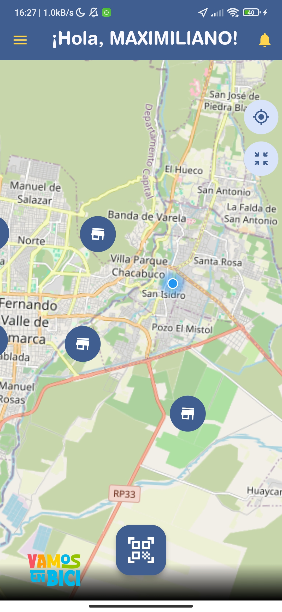

# Aplicacion Movil Ciudadado: Vamos en bici

Developer: Maximiliano Alzugaray

## Capturas de pantalla:

## ScreenShots:

## Descipcion

El proyecto sigue una arquitectura de codigo limpio ( Clean Arquitecture) basado en feactures (funcionalidades completas), por lo tanto quien trabaje en este proyecto debe seguir los patrones de:

- Dominio
- Infraestructura
- presentacion

## Dependencias

- go_router: https://pub.dev/packages/go_router
- animate_do: https://pub.dev/packages/animate_do
- mask_text_input_formatter : https://pub.dev/packages/mask_text_input_formatter
- image_picker: https://pub.dev/packages/image_picker
- riverpod: https://riverpod.dev/
- qr_code_scanner: https://pub.dev/packages/qr_code_scanner

## Paleta de colores

Esta paleta de colores esta bazada en el logo

- primary: 00458a
- red: f95361
- orange: ff9d0a
- yellow: fdcd00
- light blue: 00b8ea
- green: 94c400
- white: ffffff

## Notas:

Otras librerias sin uso:
selector de pais: https://pub.dev/packages/country_calling_code_picker

## Mapa

- flutter_osm_plugin: https://pub.dev/packages/flutter_osm_plugin
- flutter_map: https://pub.dev/packages/flutter_map ; https://docs.fleaflet.dev/

## Uso de Bluetooth en telefonos:

- Los teléfonos móviles utilizan Bluetooth Low Energy (BLE) para la comunicación inalámbrica con dispositivos cercanos. BLE consume poca energía y es ideal para dispositivos como lockers.

### Integración de Bluetooth en Flutter:

Para integrar Bluetooth en Flutter, se utiliza el paquete flutter_blue. Este paquete permite:

    flutter_blue: https://pub.dev/packages/flutter_blue/versions/0.8.0

- Escanear dispositivos Bluetooth.
- Conectarse a dispositivos Bluetooth.
- Leer y escribir datos en dispositivos Bluetooth.
